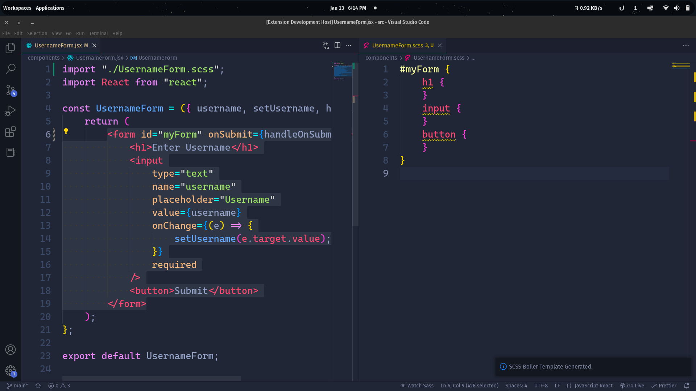

# SASS Template Generator

A VSCode Extension to generate a SASS/SCSS Template from a given HTML or JSX.

## Features

Generate a template from your given HTML or SCSS instead of having to type out the skeleton yourself.



## Requirements

The only requirment for the given extension is `node-html-parser: ^6.1.4`. To install it, change your directory to the given folder, and simply run, `npm install`.

## Known Issues

One of the issues that I am currently working to fix is when you have multiple elements as a child, with the same tag, without any class or ID, so the extension generates a parent with 4 child with the same name.

For example,
Input:

```html
<nav>
    <ul>
        <li></li>
        <li></li>
        <li></li>
        <li></li>
    </ul>
</nav>
```

It will be converted to
Output:

```scss
nav {
    ul {
        li {
        }
        li {
        }
        li {
        }
        li {
        }
    }
}
```

If you face any other issues while using the extension, please create an issue in the issues tab.

## Release Notes

Release Notes for SASS Template Generator

### 1.0.0

Initial release of SASS Template Generator

---

## Feedback

If you have any feedback, please reach out to me at talktoanmol@outlook.com
